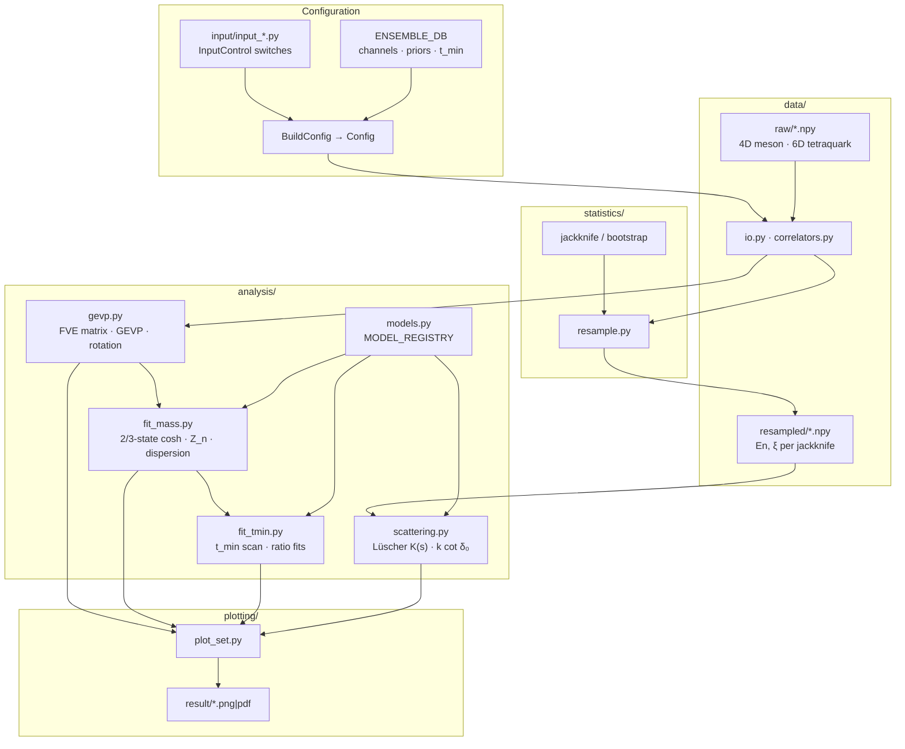

# Lattice QCD Tetraquark Scattering

[](https://github.com/Geng-Li-1995/lattice_scattering/actions/workflows/ci.yml)

Production-grade lattice QCD pipeline for **tetraquark spectroscopy** and **finite-volume scattering**: six-dimensional correlators → GEVP → multi-state Bayesian fits → ratio methods → Lüscher phase shifts, with **correlated jackknife uncertainties** propagated end-to-end.

| | |
|--|--|
| **Systems** | `Tcccc6600` · `X3872` · `Zc3900` — one `input_<System>.py` per physics setup |
| **Reference** | Fully-charm \(T_{cc\bar c\bar c}\): \(\eta_c\eta_c\) / \(J/\psi\,J/\psi\), \(L=12{+}16\), \(a_t^{-1}=7.219\) GeV |
| **Scale** | 6D raw tensors · **401** jackknife replicas · \(10^5\)-point Lüscher \(\zeta\) tables |
| **Data** | Local `data/<system>/` only (not in git) · figures in `result/<system>/` |

---

## Contents

1. [Technical overview](#technical-overview)
2. [Architecture](#architecture)
3. [Analysis capabilities](#analysis-capabilities)
4. [Software engineering](#software-engineering)
5. [Physics (Tcccc6600)](#physics-tcccc6600)
6. [Example results](#example-results)
7. [Data contract](#data-contract)
8. [Quick start](#quick-start)
9. [Configuration](#configuration)
10. [Tests & CI](#tests--ci)
11. [Publications](#publications)

---

## Technical overview

This repository implements a **modular, switch-driven** analysis chain used in lattice studies of exotic hadrons. Design goals:

- **Correct tensor geometry** — typed 4D/6D correlators; no silent axis swaps between meson and tetraquark branches.
- **Unified uncertainty** — `gvar` + jackknife/bootstrap through fits, ratio series, and scattering observables.
- **Label-driven configuration** — channel indices resolved from LaTeX names in `ENSEMBLE_DB`, not hard-coded in analysis code.
- **Decoupled stages** — spectroscopy and scattering can run independently; scattering replays from cached `resampled/` energies.

### Computational scale (Tcccc6600)

| Quantity | Value |
|----------|-------|
| Raw tetraquark rank | **6D** `[chan_src, mom_src, chan_snk, mom_snk, time, sample]` |
| Raw file size | ~30–40 MiB / volume (\(\sim10^6\)–\(10^7\) `float64`) |
| Jackknife replicas | **401** on the `sample` axis |
| Time extent \(N_t\) | 96 (\(L=12\)) / 128 (\(L=16\)) |
| Resampling cost | **401×** GEVP + fit per volume when `run_resample_analysis=True` |
| Lüscher grid | \(10^5\) \(q^2\) points, built once (`joblib` parallel) |

Meson correlators are **4D**; tetraquark raw data dominates memory. After GEVP both branches collapse to 4D for fitting.

**Stack:** Python 3.10+ · NumPy · SciPy · gvar · lsqfit · joblib · Matplotlib · pytest

---

## Architecture

### Layered pipeline



### Execution order (`main.py`)

```
BuildConfig → Config
    ├─ [optional] run_resample_statistics()  →  resampled/*.npy
    ├─ meson branch:    En, Z_n, dispersion, t_min
    └─ tetraquark branch: GEVP → En → ratio → t_min
         └─ scattering (from resampled/, no raw reload)
```

Meson and tetraquark switches are **independent**. Ratio / t_min on tetraquark loads meson raw correlators when `run_ratio_analysis=True`.

### Uncertainty propagation

| Stage | Method |
|-------|--------|
| Effective mass | `lsqfit` + `gvar` priors; jackknife slices via `statistics/jackknife.py` |
| Ratio \(R_n(t)\) | Leave-one-out correlators → ratio series → jackknife (`ratio_series_mean_err`) |
| Resampled energies | Per-replica `En`, \(\xi\) written to `resampled/` for scattering |
| Scattering | \(K(s)\), \(k\cot\delta_0\) evaluated **per jackknife sample**, then combined |
| Plots | Error bands from `gvar` mean ± sdev; t_min panels use ±10× reference error |

---

## Analysis capabilities

### 1 · Generalized eigenvalue problem (GEVP)

| Item | Implementation |
|------|----------------|
| Matrix assembly | Full finite-volume matrix from 6D tetraquark data (`analysis/gevp.py`) |
| Solve | \(C(t_1)\psi = \lambda\, C(t_0)\psi\) — `scipy.linalg.eig` |
| Rotation | `numpy.einsum` eigenvector projection |
| Output | Diagonal GEVP levels → 4D correlators per \((\text{chan}, n^2)\) |
| Figures | Before/after matrices, eigenvector heatmaps (`plot_gevp.py`) |

### 2 · Spectroscopy (effective mass)

| Item | Implementation |
|------|----------------|
| Models | Registry-based cosh: 2-state (meson) / 3-state (tetraquark) (`models.py`) |
| Fit | `lsqfit.nonlinear_fit` with channel/momentum priors from `ENSEMBLE_DB` |
| Observables | \(E_n\), \(Z_n/Z_0\), dispersion \(E_n^2(n^2)\) → lattice scale \(\xi\) |
| Figures | Multi-channel \(E_n\) overlay (`plot_mass.py`); `FIG_WIDE` layout |

### 3 · Ratio method & \(t_{\min}\) stability

| Item | Implementation |
|------|----------------|
| Shifted ratio | \(R_n(t+a_t)\) from 4Q/2Q correlator differences; `ratio_at` controls step \(2a_t\) |
| Distinguishable | \(R = C_4/(C_a C_b)\) when `is_ratio_shift=False` (open-charm systems) |
| t_min scan | Symmetric window scan; meson 2-state / tetraquark 3-state + optional ratio overlay |
| Combine | Reference energy band at configured \(t_{\min}\) on all t_min figures |
| Figures | `Ratio_{tag}` (fit-window y-limits); `En_tmin_{branch}{n}_mom{m}_{tag}` (`plot_ratio.py`, `plot_tmin.py`) |

### 4 · Finite-volume scattering

| Item | Implementation |
|------|----------------|
| Framework | Lüscher quantization condition; precomputed \(\zeta(q^2)\) under `data/zeta/` |
| Observables | \(K(s)=\sqrt{s}/(k\cot\delta_0)\); phase shift from \(k\cot\delta_0(k^2)\) |
| Frames | Rest frame; **moving frame** (`run_MF_analysis`, `MF_d_vec`, X3872) |
| Multi-\(L\) | `scattering_Ns_mom` selects momentum subset per spatial size |
| Fits | `Ks_linear` or `kcot_quadratic` (`scattering_fit_mode`) |
| Figures | \(K(s)\) vs \(s\); \(k\cot\delta_0\) vs \(k^2\) with below-threshold \(ik\) guide (`plot_scattering.py`) |

### 5 · Resampling & I/O

| Item | Implementation |
|------|----------------|
| Jackknife | Leave-one-out on `sample` axis (401 replicas) |
| Bootstrap | Optional (`resample_type`, `n_boot`) |
| Paths | Centralized in `data/io.py`; ensemble tags `L{Ns}M{M}_EV{EV}` |
| Types | `Correlator4D`, `TetraquarkCorrelator`, `AnalysisCorrelators` — shape-safe `.at()` |

---

## Software engineering

### Configuration model

```
input/input_<System>.py
├── InputControl          # user switches (3 sections: mass · scattering · plot)
├── ENSEMBLE_DB           # per-ensemble meson/tetraquark blocks
└── get_lattice_params()  # lattice_Ns → (Ns, Nt, M_π, EV)

BuildConfig("<System>").build_config_from_control("meson" | "tetraquark")
    → frozen Config dataclass
```

Branch-gated switches (`_branch_switches`): e.g. dispersion only on meson config; GEVP/ratio only on tetraquark.

### Channel resolution (by label fields)

Physics channels are matched from **string labels**, not array indices:

| Field | Resolves to |
|-------|-------------|
| `channel_name_list` / `channel_momentum_list` | Chan axis and \(n^2\) values per ensemble |
| `scattering_channel` | `ScatteringChanMatch` → meson a, meson b, tetra indices |
| `scattering_channel_MF` | Moving-frame tetra channel (defaults to rest) |
| `ratio_point_by_label(config, label, n²)` | `ChanMom(chan, mom)` for ratio / t_min lookup |

Tetraquark labels such as `r"J/\psi\,J/\psi"` split on `\,` into meson tokens; normalization ignores separators when matching `scattering_channel`.

### Extensibility

| Task | Steps |
|------|-------|
| New hadron system | Copy `input_<System>.py` → add `data/<System>/raw/` → `BuildConfig("System")` in `main.py` |
| New fit model | Register in `analysis/models.py` → `MODEL_REGISTRY` |
| New plot | Subclass `BasePlotter` in `plotting/plot_set.py` |

### Code layout

```
lattice_scattering/
├── main.py
├── input/          config.py · input_{Tcccc6600,X3872,Zc3900}.py
├── data/           correlators.py · io.py · <System>/{raw,resampled}/ · zeta/
├── analysis/       gevp · fit_mass · fit_tmin · scattering · models
├── statistics/     jackknife · bootstrap · resample
├── plotting/       plot_set · plot_gevp · plot_mass · plot_ratio · plot_tmin · plot_scattering
├── result/<System>/    example figures (tracked)
├── docs/           RUNNING · TESTING · DEPENDENCIES
└── tests/          60+ unit tests, synthetic data only
```

---

## Physics (Tcccc6600)

Fully-charm tetraquarks \(T_{cc\bar{c}\bar{c}}\) are exotic-hadron candidates at the LHC. This analysis chain targets \(\eta_c\eta_c\) and \(J/\psi\,J/\psi\) scattering and comparison with LHC data.

**Key result:** a **\(2^{++}\)** candidate in \(J/\psi\,J/\psi\) near **6.6 GeV**, compatible with **\(X(6600)\)** ([Nature **648**, 58 (2025)](https://www.nature.com/articles/s41586-025-09278-2); [arXiv:2506.07944](https://arxiv.org/abs/2506.07944)), with separate **\(0^{++}\)** and **\(2^{++}\)** amplitudes from one GEVP spectrum.

**Scattering observables:** \(K(s)\) vs \(s=m_{\rm CM}^2\) encodes S-wave interaction strength; \(k\cot\delta_0\) gives the phase shift \(\delta_0\). **Zeros of \(K(s)\) are S-matrix poles** — resonance or bound-state positions to compare with experimental enhancements such as \(X(6600)\) in double-\(J/\psi\) production.

---

## Example results

\(L=12\) (`L12M420_EV170`) unless noted; \(t_{\min}\) scans on \(L=16\) (`L16M420_EV120`).

### GEVP

<p align="center">
  
  
</p>

Eigenvectors \(v_\beta^{(n)}\):

<p align="center">
  
</p>

<p align="center"><sub><code>GEVP_eigenvector_L12M420_EV170</code></sub></p>

### Effective mass \(E_n\)

<p align="center">
  
  
</p>

### Ratio \(R_n(t/a_t)\)

Shifted 4Q/2Q data + reference-window fit. **Left:** \(L=12\); **right:** \(L=16\).

<p align="center">
  
  
</p>

<p align="center"><sub><code>Ratio_L12M420_EV170</code> · <code>Ratio_L16M420_EV120</code></sub></p>

### \(t_{\min}\) scan — meson

2-state ○ + Combine. \(\eta_c\) / \(J/\psi\), \(n^2=0\), \(L=16\).

<p align="center">
  
  
</p>

### \(t_{\min}\) scan — tetraquark (\(J/\psi\,J/\psi\), \(n^2=0,1\))

3-state ○, ratio ×, Combine.

<p align="center">
  
  
</p>

### Scattering (\(L=12+16\))

<p align="center">
  
  
</p>

---

## Data contract

All arrays: **`float64`**. **`sample` = 401** jackknife replicas. **`mom`** indexes \(n^2\). **`EV`** in filenames = distillation eigenvectors.

### Tensor shapes

| Object | Axes |
|--------|------|
| Meson raw | `[chan, mom, time, sample]` |
| Tetraquark raw | `[chan_src, mom_src, chan_snk, mom_snk, time, sample]` |
| After GEVP | `[chan, mom, time, sample]` |
| Resampled `En` | `[chan, mom, sample]` |

### Supported systems

| System | \(L\) | EV | Tetraquark channels | Workflow |
|--------|-------|-----|---------------------|----------|
| **Tcccc6600** | 12, 16 | 170 / 120 | \(\eta_c\eta_c\), \(J/\psi J/\psi\) | Full: GEVP · ratio · t_min · scattering |
| **X3872** | 16 | 70 | \(\chi_{c1}\), \(DD^*\), \(J/\psi\omega\) | GEVP · MF scattering (`kcot_quadratic`) |
| **Zc3900** | 16 | 70 | \(\pi J/\psi\), \(\rho\eta_c\), \(DD^*\), \(D^*D^*\) | Scattering-first (spectroscopy optional) |

### Raw sizes (Tcccc6600)

| File | Shape | Size |
|------|-------|------|
| `correlation_meson_L12M420_EV170.npy` | `[2, 10, 96, 401]` | 5.9 MiB |
| `correlation_tetraquark_L12M420_EV170.npy` | `[2, 5, 2, 5, 96, 401]` | 29 MiB |
| `correlation_meson_L16M420_EV120.npy` | `[2, 10, 128, 401]` | 7.9 MiB |
| `correlation_tetraquark_L16M420_EV120.npy` | `[2, 5, 2, 5, 128, 401]` | 39 MiB |

Resampled energies under `data/<system>/resampled/` enable scattering **without** reloading raw correlators.

---

## Quick start

```bash
git clone https://github.com/Geng-Li-1995/lattice_scattering.git
cd lattice_scattering
python3 -m venv .venv && source .venv/bin/activate
pip install -r requirements.txt -r requirements-dev.txt
MPLBACKEND=Agg pytest && python main.py
```

Place lattice data under `data/<System>/` before running. See [docs/RUNNING.md](docs/RUNNING.md) · [docs/TESTING.md](docs/TESTING.md) · [docs/DEPENDENCIES.md](docs/DEPENDENCIES.md).

---

## Configuration

### Control switches (`input/input_<System>.py`)

```python
# Effective mass
lattice_Ns = 12
run_meson_analysis = True
run_tetraquark_analysis = True
run_GEVP_analysis = True
run_tmin_analysis = True
run_ratio_analysis = True       # loads meson raw for denominators
is_ratio_shift = True           # R_n(t+a_t) vs R = C4/(Ca Cb)
ratio_at = 1
run_resample_analysis = False   # True → 401× jackknife write-out

# Scattering
run_scattering_analysis = True
scattering_channel = r"J/\psi\,J/\psi"
scattering_Ns_mom = {12: [0, 1, 2], 16: [0, 1]}
scattering_fit_mode = "Ks_linear"   # or "kcot_quadratic"
run_MF_analysis = False             # moving frame (X3872)

# Plot
plot_format = "png"                 # or "pdf"
is_plot_title = True
is_plot_show = True
k_sq_plot_range = (-0.25, 1.75, -15.0, 15.0)
s_plot_range = (37, 45, -9.0, 6.0)
```

### Figure naming (tag = `L{Ns}M{M}_EV{EV}`)

| Plot | Pattern |
|------|---------|
| GEVP | `GEVP_{before,after,eigenvector}_{tag}` |
| \(E_n\) | `En_{meson,tetraquark}_{tag}` |
| Ratio | `Ratio_{tag}` |
| \(t_{\min}\) | `En_tmin_{meson,tetraquark}{n}_mom{m}_{tag}` |
| Scattering | `K_s_scattering`, `kcot_scattering` |

---

## Tests & CI

| Coverage | Tests |
|----------|-------|
| Statistics | Jackknife mean/SE, leave-one-out |
| I/O | Path tags, `.npy` round-trip |
| Channels | Label → index for all three systems |
| Ratio | Series algebra, `ratio_scan_lookup`, fit-window y-limits |
| Scattering | Lüscher algebra, `fit_mom_indices`, MF rows |
| Config | Branch gating, plot flags |

**60+** pytest cases on Python **3.10** & **3.12** — synthetic arrays only, no lattice files in CI ([workflow](.github/workflows/ci.yml)).

---

## Publications

- G. Li, C. Shi, Y. Chen, and W. Sun, [*Scalar and Tensor Structures in $J/\psi J/\psi$ Scattering from Lattice QCD*](https://arxiv.org/abs/2505.24213), arXiv:2505.24213 [hep-lat]
- G. Li, C. Shi, Y. Chen, and W. Sun, [*$\eta_c\eta_c$ and $J/\psi J/\psi$ scattering from lattice QCD*](https://arxiv.org/abs/2505.23220), arXiv:2505.23220 [hep-lat]

---

## Author

**Dr. Geng Li** — lattice QCD, scientific computing, HPC. For collaboration or citation, contact via repository details.

## License

Not specified. Contact the maintainer before redistribution.
