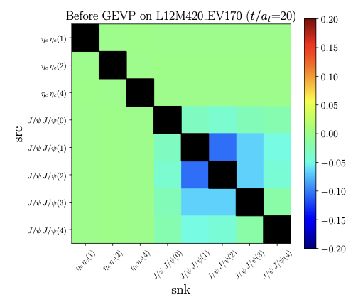
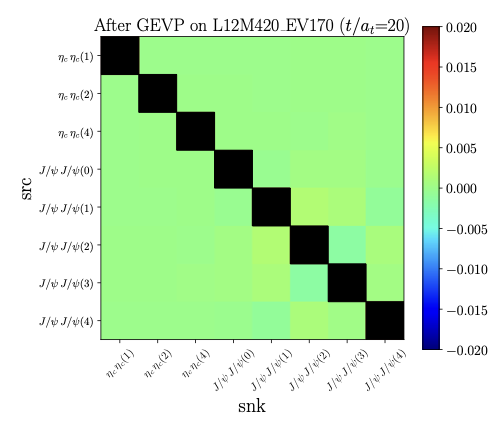
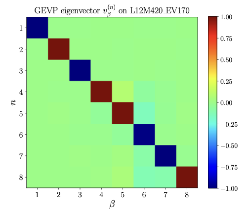
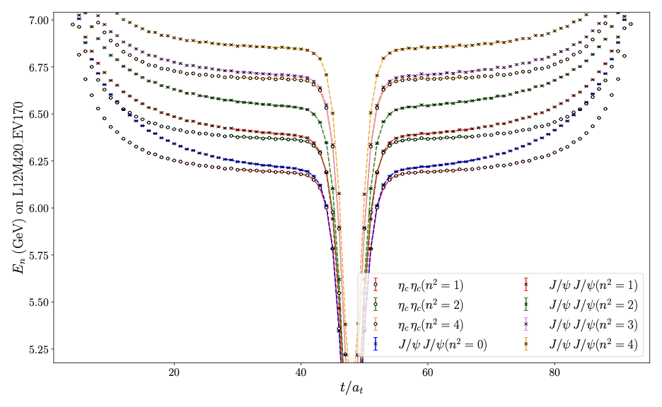
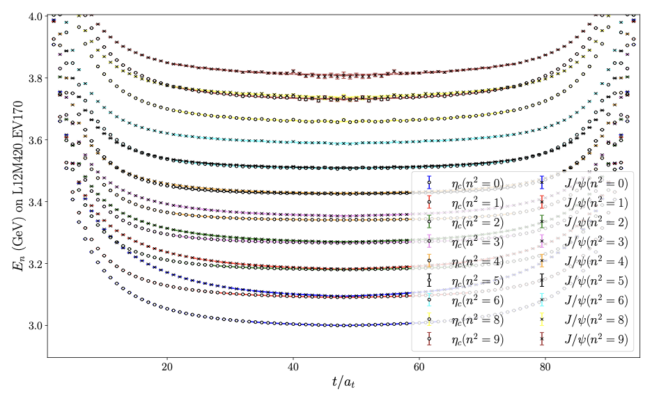
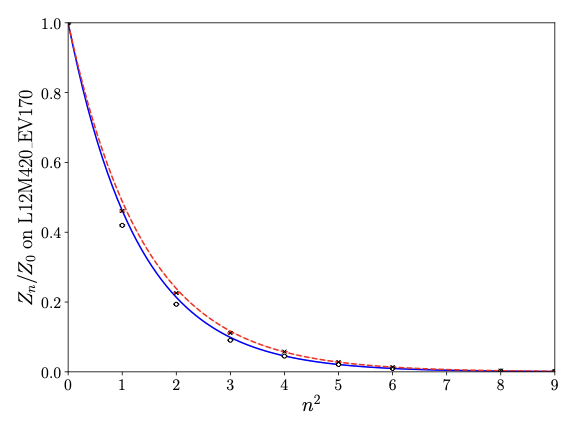
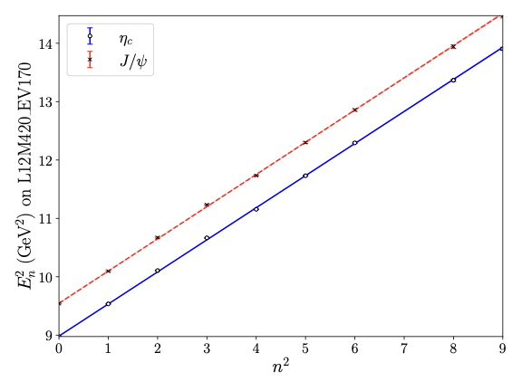
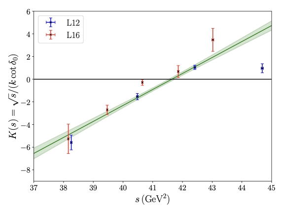
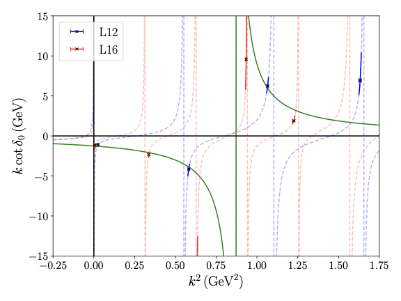

# Lattice Scattering Analysis Pipeline

A modular Python pipeline for **lattice QCD spectroscopy and Lüscher scattering analysis**. It ingests Monte Carlo correlation functions, runs GEVP diagonalization and Bayesian multi-state fits, and produces publication-ready PDF figures with full error propagation (`gvar` / `lsqfit`).

**Bundled application:** fully-charm tetraquark **Tcccc6600** (\(\eta_c\eta_c\), \(J/\psi\,J/\psi\)) on \(N_f=2\) anisotropic ensembles at \(L=12,16\), \(m_\pi\approx 420\) MeV.

---

## What the Code Does

| Capability | Module | Output |
|------------|--------|--------|
| Load raw / resampled `.npy` correlators | `data/io.py` | `raw_dict`, `resampled_dict` |
| Build FVE matrix, solve GEVP | `analysis/gevp.py` | Effective-operator `corr_dict` |
| Multi-state cosh fits (\(E_n\), \(Z_n\)) | `analysis/fitting.py` + `analysis/models.py` | `en_fit_list` |
| Dispersion calibration (\(\xi\) from \(E_n^2\) vs \(n^2\)) | `analysis/fitting.py` | `disp_fit_list` (meson mode) |
| Jackknife / bootstrap resampling | `statistics/` | `data/<system>/resampled/*.npy` |
| Lüscher zeta scattering | `analysis/scattering.py` | `scattering_dict` → \(K(s)\), \(k\cot\delta_0\) |
| Unified plot styling | `plotting/plot_set.py` | Colors, markers, TeX fonts, figure sizes |
| PDF figures | `plotting/plot_*.py` | `result/<system>/*.pdf` |

**Design goals:** configuration, I/O, analysis, statistics, and plotting are decoupled. A new physics system needs only `input/<System>_input.py` and a one-line change in `main.py`.

---

## Code Structure

```
lattice_scattering/
├── main.py                  # GEVP → fits → plots → scattering
├── run_resample.py          # Jackknife / bootstrap → resampled energies
├── input/
│   ├── config.py            # BuildConfig → immutable Config dataclass
│   ├── Tcccc6600_input.py   # InputControl switches + ENSEMBLE_DB priors
│   ├── selector.py          # Pick correlator array and fit model from config
│   └── types.py             # Type aliases and variable naming conventions
├── data/io.py               # read_raw_files(), read_file()
├── analysis/
│   ├── gevp.py              # FVE matrix, GEVP solver
│   ├── fitting.py           # RunFitting: effective_mass(), dispersion()
│   ├── scattering.py        # Lüscher zeta, K(s) / kcot fits
│   ├── models.py            # Cosh models, priors, MODEL_REGISTRY
│   └── utils.py             # en_fit_lookup, disp_fit_lookup, fve_offsets
├── statistics/
│   ├── jackknife.py / bootstrap.py
│   └── resample.py          # run_resample_statistics()
└── plotting/
    ├── plot_set.py          # RC_PARAMS, COLORS, save_figure()
    ├── plot_gevp.py
    ├── plot_mass.py         # En, Zn, Dispersion
    └── plot_scattering.py   # K_s, kcot
```

**Naming conventions** (see `input/types.py`):

| Variable | Meaning |
|----------|---------|
| `raw_dict` | Raw correlators from disk |
| `corr_dict` | Correlators after GEVP (ready for fitting) |
| `resampled_dict` | Jackknife/bootstrap energies and \(\xi\) |
| `en_fit_list` / `disp_fit_list` | Effective-mass / dispersion fit results |
| `scattering_dict` | Scattering observables per ensemble |

---

## Pipeline

Two entry points — always run from the **project root**:

```
data/<system>/raw/*.npy
        │
        ├─► run_resample.py          (Step 1 — before scattering)
        │         └─► data/<system>/resampled/*.npy
        │
        └─► main.py                    (Step 2 — analysis + plots)
              ├─► process_GEVP()       (tetraquark mode only)
              ├─► effective_mass()     (always; plots gated by plot_meff)
              ├─► dispersion()         (meson + plot_dispersion only)
              └─► run_scattering_analysis()  (tetraquark + run_scattering)
```

### `main.py` execution order

1. `BuildConfig("Tcccc6600").build_config_from_control()` — load `InputControl` + `ENSEMBLE_DB`
2. `read_file()` — raw correlators; resampled files if `run_scattering=True`
3. `process_GEVP()` — **tetraquark mode only**; builds FVE matrix, optional GEVP diagonalization
4. GEVP plots — if `is_gevp=True` and tetraquark mode (`GEVP_before/after/eigenvector_<tag>.pdf`)
5. `effective_mass()` — always runs; fit diagnostics printed to stdout
6. Mass plots — if `plot_meff=True`: `En_<type>_<tag>.pdf`, `Zn_meson_<tag>.pdf` (Zn meson-only)
7. Dispersion — if `plot_dispersion=True` **and** `is_meson_analysis=True`: fit + `Dispersion_meson_<tag>.pdf`
8. Scattering — if `run_scattering=True` **and** `is_tetraquark_analysis=True`: `K_s_scattering_<tag>.pdf`, `kcot_scattering_<tag>.pdf`

**Analysis modes are mutually exclusive.** `InputControl.__post_init__` resolves conflicts: if both flags are `True`, **tetraquark wins**. Meson \(Z_n\) / dispersion require a separate run with `is_meson_analysis=True`, `is_tetraquark_analysis=False`.

**Tetraquark + scattering** needs resampled meson energies and \(\xi\) from prior meson resample runs (see [docs/RUNNING.md](docs/RUNNING.md) §5).

---

## Configuration

All parameters live in `input/Tcccc6600_input.py`.

```python
# InputControl — key runtime switches (defaults)
lattice_Ns: int = 12
is_meson_analysis: bool = False
is_tetraquark_analysis: bool = True   # default workflow
is_gevp: bool = True
run_scattering: bool = True
plot_meff: bool = True                # En and Zn plots
plot_dispersion: bool = True          # dispersion fit + plot (meson only)
resample_type: str = "jackknife"      # or "bootstrap"

# Scattering channel indices and K(s) fit momentum subsets
ch_meson_a: int = 1
ch_meson_b: int = 1
ch_tetra: int = 1
fit_mom_by_ns: Dict[int, List[int]] = {12: [0, 1, 2], 16: [0, 1]}
```

`ENSEMBLE_DB` holds per-ensemble channel lists, fit windows (`tmin_arry`), Bayesian priors, GEVP times, and \(a^{-1}\).

| \(L\) | \(N_t\) | \(m_\pi\) (MeV) | EV | \(a^{-1}\) (GeV) |
|-------|---------|-----------------|-----|------------------|
| 12 | 96 | 420 | 170 | 7.219 |
| 16 | 128 | 420 | 120 | 7.219 |

Scattering combines both volumes via `Ns_list = [12, 16]`.

To switch systems, change the name in `main.py` and `run_resample.py`:

```python
config = BuildConfig("Tcccc6600").build_config_from_control()
```

---

## Quick Start

**Requirements:** Python 3.10+, TeX (for default LaTeX labels). See [docs/DEPENDENCIES.md](docs/DEPENDENCIES.md).

```bash
git clone https://github.com/Geng-Li-1995/lattice_scattering.git
cd lattice_scattering
python3 -m venv .venv && source .venv/bin/activate
pip install -r requirements.txt

# Step 1 — resampling (required before scattering)
python run_resample.py

# Step 2 — analysis and plotting
python main.py
```

> Raw correlators (`data/**/raw/*.npy`) and resampled files are **not** in this repository. Place them locally before running. Full setup: [docs/RUNNING.md](docs/RUNNING.md).

---

## Data Availability

| Content | In repository? |
|---------|----------------|
| Analysis source code | Yes |
| Configuration (`input/Tcccc6600_input.py`) | Yes |
| Result PDFs (`result/Tcccc6600/`) | Yes |
| README preview PNGs (`docs/figures/`) | Yes |
| Raw correlators (`data/**/raw/*.npy`) | **No** (~80 MB) |
| Resampled energies (`data/**/resampled/*.npy`) | **No** |

| File pattern | Shape / content |
|--------------|-----------------|
| `correlation_meson_L{Ns}M{M}_EV{EV}.npy` | `[channel, momentum, time, sample]` |
| `correlation_tetraquark_L{Ns}M{M}_EV{EV}.npy` | `[ch_src, mom_src, ch_snk, mom_snk, time, sample]` |
| `resample_En_{type}_L{Ns}M{M}_EV{EV}.npy` | Per-configuration energies |
| `resample_ksi_meson_L{Ns}M{M}_EV{EV}.npy` | Dispersion scale \(\xi\) |

Output PDFs: `En_<type>_<tag>.pdf`, `GEVP_before_<tag>.pdf`, `K_s_scattering_<tag>.pdf`, etc., with `<tag>` = `L12M420_EV170`.

---

## Example Results

Representative outputs for **\(L=12\)** (`L12M420_EV170`). Full PDFs for \(L=12\) and \(L=16\) are in [`result/Tcccc6600/`](result/Tcccc6600/).

### GEVP (before / after diagonalization)

<p align="center">
  
  
</p>

### GEVP eigenvectors

<p align="center">
  
</p>

### Effective mass \(E_n\)

<p align="center">
  
  
</p>

### Overlap factors \(Z_n/Z_0\) and dispersion \(E_n^2\)

<p align="center">
  
  
</p>

### Scattering observables

<p align="center">
  
  
</p>

---

## Physics Context

Fully-charm tetraquarks \(T_{cc\bar{c}\bar{c}}\) are among the most striking exotic-hadron candidates seen at the LHC. Lattice QCD provides a **first-principles** way to study \(\eta_c\eta_c\) and \(J/\psi\,J/\psi\) interactions without model-dependent assumptions about internal structure.

**Results enabled by this pipeline:**

- First lattice QCD evidence for a **\(2^{++}\) resonance** in the \(J/\psi\,J/\psi\) sector near 6.6 GeV, compatible with the broad **\(X(6600)\)** structure reported by ATLAS and CMS.
- Preferred \(J^{PC}=2^{++}\) assignment consistent with the CMS angular analysis in [Nature **648**, 58 (2025)](https://www.nature.com/articles/s41586-025-09278-2) ([arXiv:2506.07944](https://arxiv.org/abs/2506.07944)).
- Separate \(0^{++}\) and \(2^{++}\) scattering amplitudes via the Lüscher formalism after GEVP removes operator mixing.

### Publications

- G. Li, C. Shi, Y. Chen, and W. Sun, [*Scalar and Tensor Structures in $J/\psi J/\psi$ Scattering from Lattice QCD*](https://arxiv.org/abs/2505.24213), arXiv:2505.24213 [hep-lat]
- G. Li, C. Shi, Y. Chen, and W. Sun, [*$\eta_c\eta_c$ and $J/\psi J/\psi$ scattering from lattice QCD*](https://arxiv.org/abs/2505.23220), arXiv:2505.23220 [hep-lat]

### Methods (brief)

| Method | Role |
|--------|------|
| **GEVP** | Diagonalize the \(\eta_c\eta_c\)–\(J/\psi\,J/\psi\) matrix; suppress contaminations |
| **Multi-state cosh fit** | Extract \(E_n\), \(Z_n\) with Bayesian priors |
| **Dispersion relation** | Calibrate lattice spacing \(\xi\) from \(E_n^2\) vs \(n^2\) |
| **Lüscher zeta function** | Finite-volume energies → \(k\cot\delta_0\), \(K(s)\) |
| **Jackknife / bootstrap** | Statistical errors on per-configuration fits |

---

## Notes

- Plotting calls `plt.show()`; on headless systems set matplotlib backend `Agg` (see [docs/RUNNING.md](docs/RUNNING.md) §5).
- Zeta lookup table is cached at `data/zeta/zeta_00_rest_array.npy` after first generation.
- Stack: `numpy`, `scipy`, `matplotlib`, `gvar`, `lsqfit`, `joblib`.

---

## License

Not specified. Contact the maintainer before redistribution.
