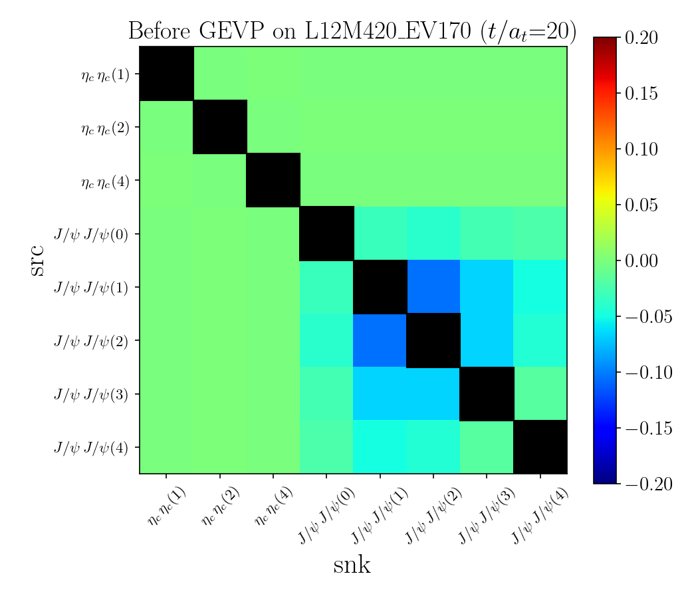
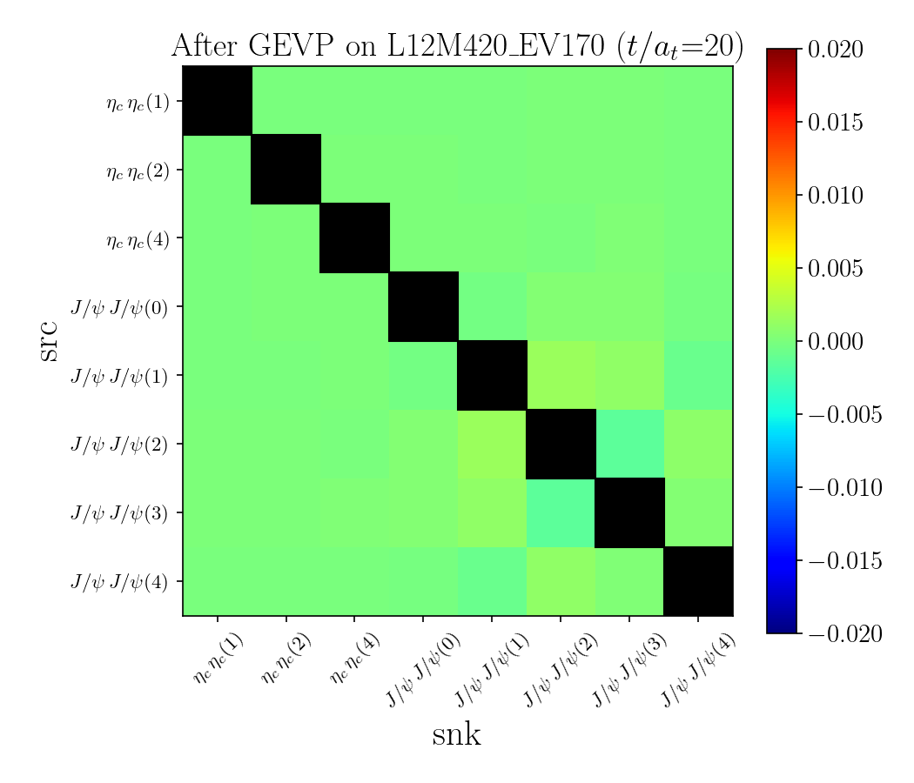
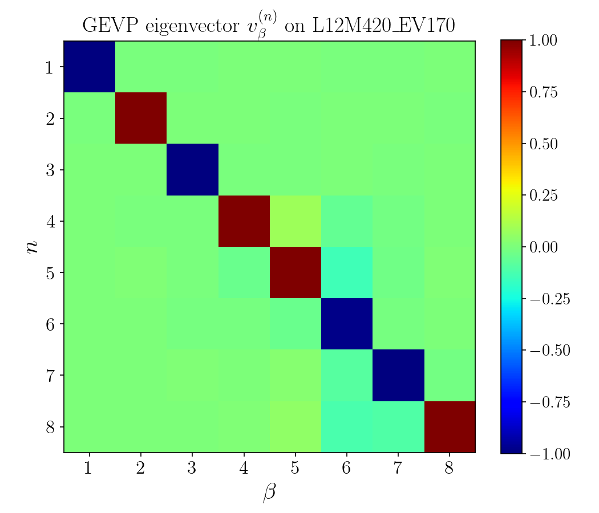
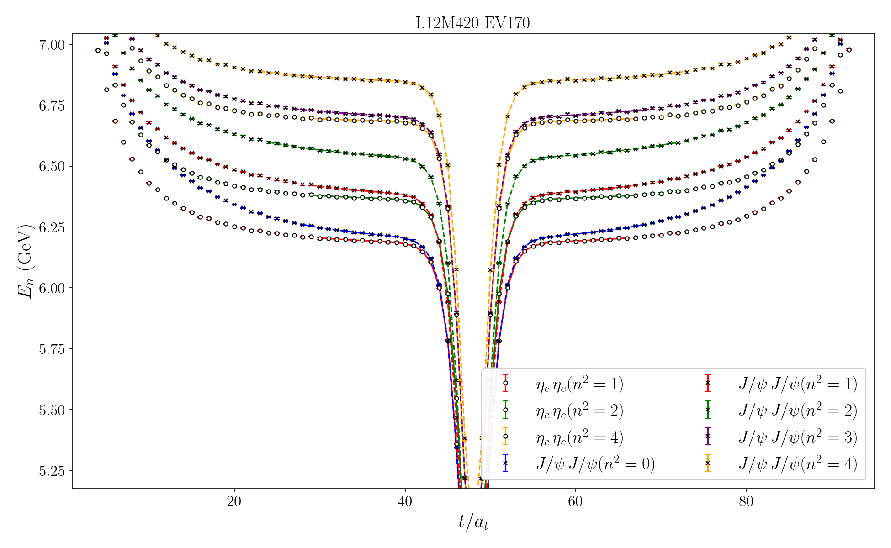
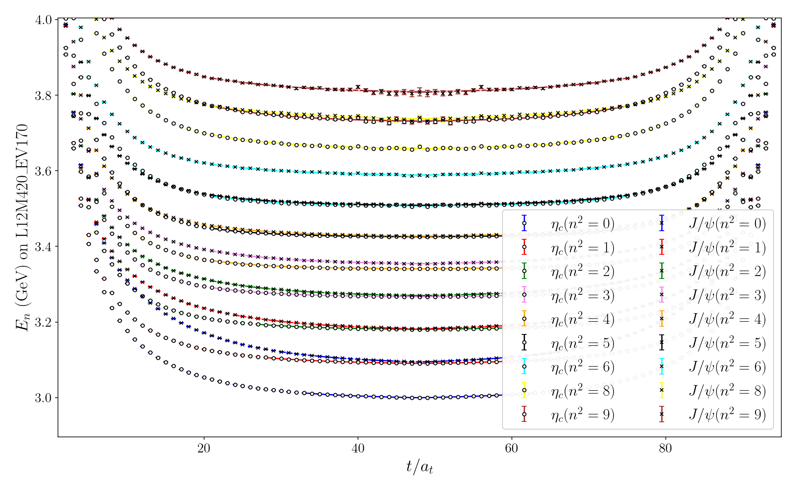
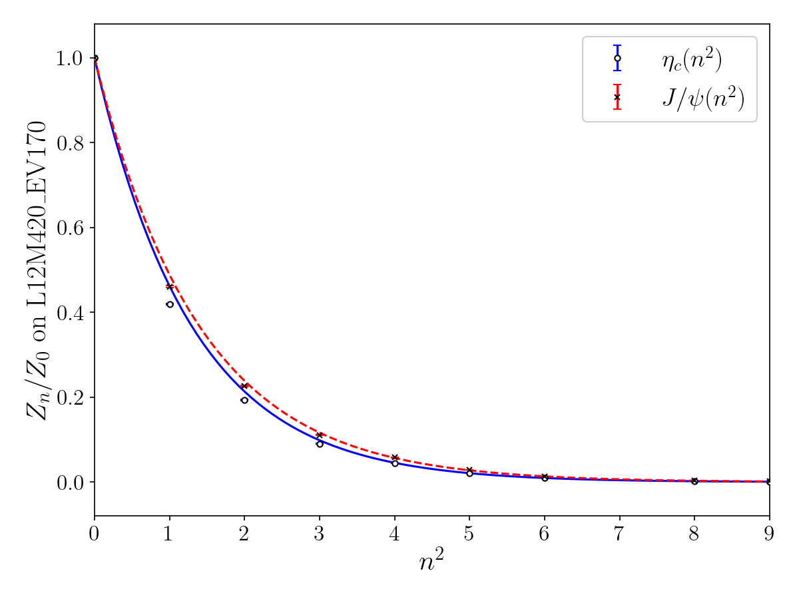
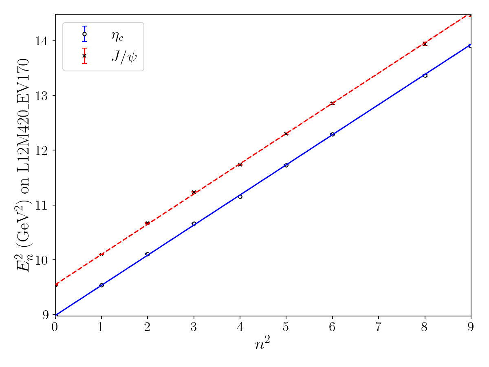
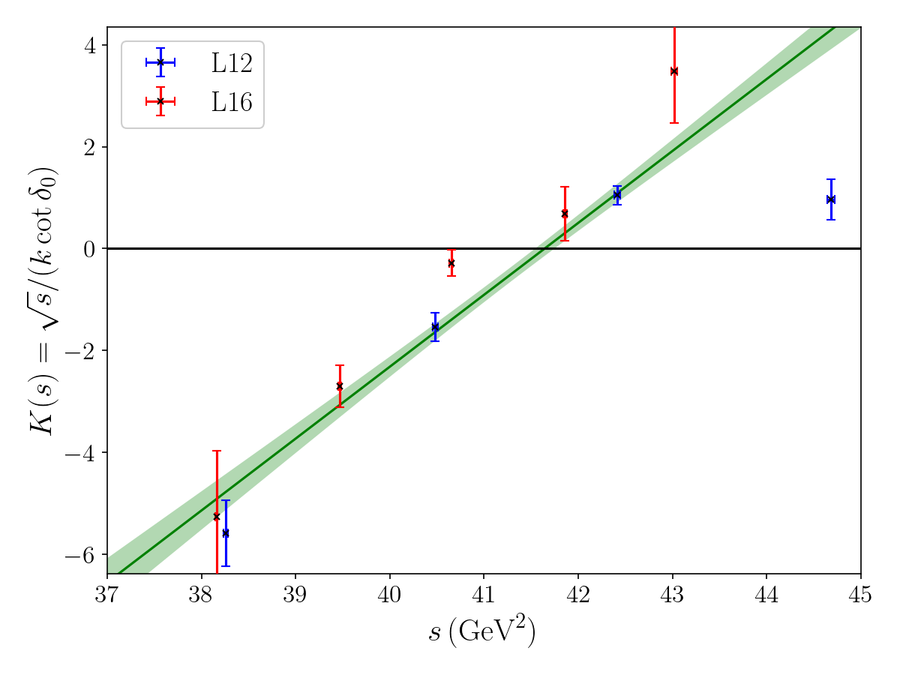
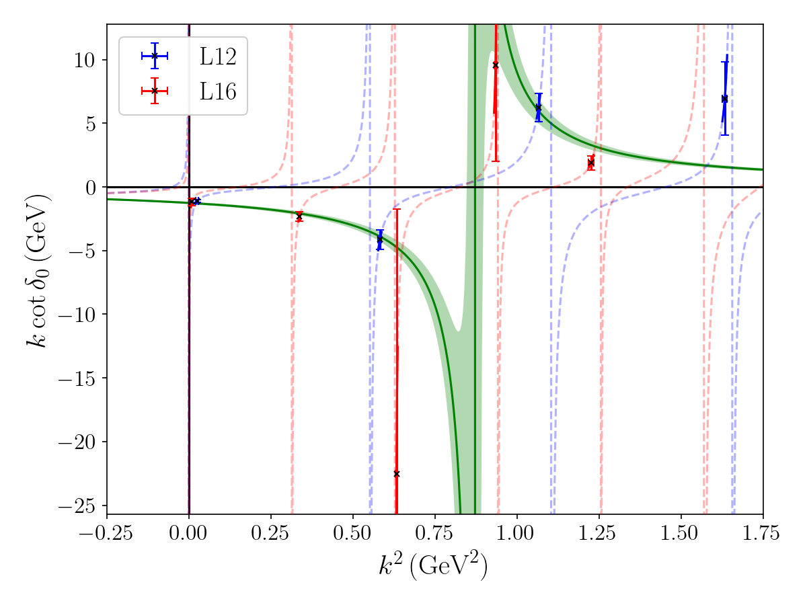

# Lattice QCD Tetraquark Scattering Pipeline

**Config-driven Python pipeline for lattice QCD tetraquark spectroscopy and finite-volume scattering analysis** — ingests large Monte Carlo correlation-function datasets, performs generalized eigenvalue decomposition (GEVP), Bayesian multi-state fits, jackknife/bootstrap resampling, and Lüscher scattering extraction with full statistical error propagation.

The same code path is shared by multiple four-quark systems. System-specific physics choices live in `input/input_<System>.py`: channel names, momentum lists, ensemble metadata, fit windows, priors, scattering channels, and resampling/scattering switches.

**Showcase system:** fully-charm tetraquark **Tcccc6600** (\(\eta_c\eta_c\), \(J/\psi\,J/\psi\)) on \(N_f=2\) anisotropic ensembles (\(L=12,16\), \(N_t=96/128\), \(m_\pi\approx 420\) MeV, **400 gauge configurations** per volume, **120–170 distillation eigenvectors** depending on \(L\), \(a_t^{-1}=7.219\) GeV).

---

## Supported Systems

The repository includes input configurations for three tetraquark scattering systems. Switch systems by changing the system name passed to `BuildConfig(...)` in `main.py`; the analysis modules and plotting code do not need system-specific edits.

| System | Input file | Ensembles in config | Channel setup | Example raw correlator dimensions |
|--------|------------|---------------------|---------------|-----------------------------------|
| `Tcccc6600` | `input/input_Tcccc6600.py` | \(L=12,16\), \(m_\pi=420\), EV \(170/120\), \(a_t^{-1}=7.219\) GeV | \(\eta_c\eta_c\), \(J/\psi J/\psi\) | meson `[2, 10, Nt, 400]`; tetraquark `[2, 5, 2, 5, Nt, 400]` |
| `X3872` | `input/input_X3872.py` | \(L=16\), \(m_\pi=420\), EV \(70\), \(a_t^{-1}=7.219\) GeV | \(\pi J/\psi\), \(\rho\eta_c\), \(DD^*\), \(D^*D^*\) | meson `[6, 5, Nt, Ncfg]`; tetraquark `[4, 2, 4, 2, Nt, Ncfg]` |
| `Zc3900` | `input/input_Zc3900.py` | \(L=16\), \(m_\pi=420\), EV \(70\), \(a_t^{-1}=7.219\) GeV | \(\pi J/\psi\), \(\rho\eta_c\), \(DD^*\), \(D^*D^*\) | meson `[6, 5, Nt, Ncfg]`; tetraquark `[4, 2, 4, 2, Nt, Ncfg]` |

Only source code, input files, docs, and selected result figures are versioned. Raw correlator and resampled `.npy` data for all systems must be provided locally under `data/<system>/`; they are intentionally ignored by git and are not synchronized to GitHub.

### Adapting Another Tetraquark System

To add or retune a four-quark system, copy an existing `input/input_<System>.py` and update:

- `InputControl`: default ensemble, analysis/resampling/scattering switches, scattering channel indices, and `fit_mom_by_ns`.
- `get_lattice_params()`: maps each spatial volume \(L\) to `(Ns, Nt, pion_mass, num_eigenvectors)`.
- `ENSEMBLE_DB`: channel names, momentum lists, GEVP times, fit windows, and fit priors for meson and tetraquark branches.
- Local data under `data/<System>/`: meson arrays must be `[channel, momentum, time, sample]`; tetraquark arrays must be `[ch_src, mom_src, ch_snk, mom_snk, time, sample]`.

The analysis code then uses the same `main.py`, GEVP, fitting, resampling, plotting, and scattering modules.

---

## Highlights

| Domain | What this repo demonstrates |
|--------|----------------------------|
| **HPC / large-scale numerics** | Batch processing of high-dimensional correlator arrays (4D meson, 6D tetraquark); jackknife/bootstrap over large gauge ensembles, each resample rerunning GEVP + fits |
| **Scientific computing** | Generalized eigenvalue problems (`scipy.linalg.eig`), tensor contractions (`numpy.einsum`), cached Lüscher zeta summation on \(10^5\)-point grids |
| **Statistical inference** | Bayesian nonlinear fits (`lsqfit` + `gvar`); jackknife / bootstrap resampling with correlated uncertainties end-to-end |
| **Parallel computing** | `joblib` parallel zeta-table precomputation (`n_jobs=-1`) and vectorized NumPy tensor operations to reduce runtime bottlenecks |
| **Software engineering** | Modular pipeline (I/O → analysis → statistics → plotting); typed dataclass wrappers; config-driven `ENSEMBLE_DB`; one entrypoint for multiple tetraquark systems; publication-ready figures (`plot_format`: PNG or PDF) |

**Stack:** Python 3.10+ · NumPy · SciPy · gvar · lsqfit · joblib · Matplotlib (LaTeX)

---

## Scientific Context

Fully-charm tetraquarks \(T_{cc\bar{c}\bar{c}}\) are among the most striking exotic-hadron candidates seen at the LHC. Lattice QCD provides a **first-principles, model-independent** route to \(\eta_c\eta_c\) and \(J/\psi\,J/\psi\) interactions and scattering amplitudes.

**Key results enabled by this pipeline:**

- First lattice QCD evidence for a **\(2^{++}\) resonance** in the \(J/\psi\,J/\psi\) sector near 6.6 GeV, compatible with the broad **\(X(6600)\)** structure reported by ATLAS and CMS.
- Preferred \(J^{PC}=2^{++}\) assignment consistent with the CMS angular analysis ([Nature **648**, 58 (2025)](https://www.nature.com/articles/s41586-025-09278-2); [arXiv:2506.07944](https://arxiv.org/abs/2506.07944)).
- Separate \(0^{++}\) and \(2^{++}\) scattering amplitudes via the Lüscher formalism after GEVP removes operator mixing.

| Method | Role |
|--------|------|
| **GEVP** | Diagonalize the \(\eta_c\eta_c\)–\(J/\psi\,J/\psi\) matrix; suppress contaminations |
| **Multi-state cosh fit** | Extract \(E_n\), \(Z_n\) with Bayesian priors |
| **Dispersion relation** | Calibrate lattice spacing \(\xi\) from \(E_n^2\) vs \(n^2\) |
| **Lüscher zeta function** | Finite-volume energies \(\to\) \(k\cot\delta_0\), \(K(s)\) |
| **Jackknife / bootstrap** | Per-configuration statistical errors on fits and scattering observables |

---

## Pipeline Architecture

Switch-driven batch workflow — run from the **project root**:

```
Monte Carlo correlators          data/<system>/raw/*.npy
  [ch, mom, t, sample]           [ch_src, mom_src, ch_snk, mom_snk, t, sample]
         │
         └─► main.py                    controlled by InputControl switches
               ├─► run_resample_statistics()   jackknife / bootstrap → resampled/*.npy
               ├─► process_GEVP()       FVE matrix build + generalized eig (tetraquark)
               ├─► effective_mass()     Bayesian cosh fits
               ├─► dispersion()         meson calibration (optional)
               └─► run_scattering_analysis()   Lüscher zeta → K(s), k cot δ₀
                         └─► result/<system>/*.{png|pdf}   (plot_format)
```

**Compute profile:** `run_resample=True` is the heavy stage. It is a large-scale data analysis pass over the gauge ensemble: for jackknife it performs \(O(N_{\mathrm{cfg}})\) full analysis passes (**400 leave-one-out samples** for the showcase ensembles), and each pass may rerun GEVP, effective-mass fits, and dispersion fits. Without vectorized array operations, cached intermediate products, and parallel zeta-table generation, this stage can be very time-consuming. Scattering then loads precomputed resampled energies and runs the lighter finite-volume fits plus figure generation. Zeta tables are built once in parallel and cached at `data/zeta/zeta_00_rest_array.npy`.

Performance-sensitive pieces are written to avoid unnecessary Python loops where possible: GEVP rotations use `numpy.einsum`, correlator containers keep array access shape-stable, resampled outputs are stored once and reused by scattering runs, and the expensive Lüscher zeta lookup is parallelized with `joblib`. This keeps repeated plotting/scattering runs fast after the resampled `.npy` files and zeta cache exist.

---

## Capabilities & Modules

| Capability | Module | Output |
|------------|--------|--------|
| Load raw / resampled `.npy` correlators | `data/io.py` | `RawCorrelators`, `resampled` |
| Typed array wrappers (shape-safe I/O) | `data/correlators.py` | `Correlator4D`, `TetraquarkCorrelator` |
| Build FVE matrix, solve GEVP | `analysis/gevp.py` | `AnalysisCorrelators` |
| Multi-state cosh fits (\(E_n\), \(Z_n\)) | `analysis/fit_mass.py` + `models.py` | `en_fit_list` |
| Dispersion calibration (\(\xi\)) | `analysis/fit_mass.py` | `disp_fit_list` (meson mode) |
| Jackknife / bootstrap resampling | `statistics/` | `data/<system>/resampled/*.npy` |
| Lüscher zeta scattering | `analysis/scattering.py` + `zeta.py` | per-sample \(K(s)\), \(k\cot\delta_0\) |
| Scattering-phase fit | `analysis/fit_scattering.py` | `fit_Ks_curve`, `fit_kcot_curve` |
| Unified plot styling | `plotting/plot_set.py` | TeX fonts, z-order, `save_figure()` |
| Figure output | `plotting/plot_*.py` | `result/<system>/*.{png,pdf}` (see naming below) |

**Design:** configuration, I/O, analysis, statistics, and plotting are decoupled. A new tetraquark system needs only `input/input_<System>.py`, local `data/<System>/` arrays with the documented shapes, and a one-line change in `main.py`.

---

## Code Structure

```
lattice_scattering/
├── main.py                  # GEVP → fits → plots → scattering
├── input/
│   ├── config.py            # BuildConfig → immutable Config dataclass
│   ├── input_Tcccc6600.py   # InputControl switches + ENSEMBLE_DB priors
│   ├── input_X3872.py
│   ├── input_Zc3900.py
│   ├── selector.py          # Correlator4D and fit model selection
│   └── types.py             # Type aliases
├── data/
│   ├── correlators.py       # Correlator4D, TetraquarkCorrelator, Raw/AnalysisCorrelators
│   ├── io.py                # read_raw_files(), read_resampled_files(), path tags
│   └── scattering_io.py     # moving-frame scatter cache I/O
├── analysis/
│   ├── gevp.py              # FVE matrix, scipy generalized eig, einsum rotation
│   ├── fit_mass.py          # RunFitting: effective_mass(), dispersion()
│   ├── fit_scattering.py    # K(s) linear / kcot quadratic fits (scattering_fit_mode)
│   ├── scattering.py        # scattering orchestration (rest + moving frame)
│   ├── zeta.py              # Lüscher zeta tables (rest + moving frame)
│   ├── models.py            # Cosh models, priors, MODEL_REGISTRY
│   └── utils.py             # en_fit_lookup, disp_fit_lookup, fve_offsets
├── statistics/
│   ├── jackknife.py / bootstrap.py
│   └── resample.py          # run_resample_statistics()
└── plotting/
    ├── plot_set.py          # RC_PARAMS, COLORS, save_figure()
    ├── plot_gevp.py
    ├── plot_mass.py         # En, Zn, Dispersion
    └── plot_scattering.py   # K_s, kcot
```

**Data types** (`data/correlators.py`):

| Variable | Type / shape |
|----------|----------------|
| `raw` | `RawCorrelators` — meson `[ch, mom, t, sample]`, tetraquark `[ch_src, mom_src, ch_snk, mom_snk, t, sample]`; `sample` = 400 gauge configs |
| `corr` | `AnalysisCorrelators` — both branches 4D after GEVP |
| `resampled` | Per-configuration `En` and meson \(\xi\) from jackknife/bootstrap |
| `en_fit_list` / `disp_fit_list` | Effective-mass / dispersion fit results |
| `scattering_dict` | Scattering observables per ensemble |

`mom` is the momentum quantum number \(n^2\) used as an **array index** (not a sequential 0…N−1 label). Channel/momentum lists come from `chan_momt_list` in `ENSEMBLE_DB`.

Example dimensions:

- `Tcccc6600` \(L=12\): meson raw correlator `correlation_meson_L12M420_EV170.npy` has shape `[2, 10, 96, 400]`; tetraquark raw correlator `correlation_tetraquark_L12M420_EV170.npy` has shape `[2, 5, 2, 5, 96, 400]`.
- `X3872` / `Zc3900` \(L=16\): meson raw correlators follow `[6, 5, 128, Ncfg]`; tetraquark raw correlators follow `[4, 2, 4, 2, 128, Ncfg]`.

### Output figure naming

Extension comes from `plot_format` in `InputControl` (default **`png`**). Below, `{ext}` = `png` or `pdf`.

| Plot | Filename pattern | Scope |
|------|------------------|-------|
| GEVP matrix / eigenvector | `GEVP_{before,after,eigenvector}_L{Ns}M{M}_EV{EV}.{ext}` | Single ensemble (`lattice_Ns`) |
| Effective mass | `En_{meson,tetraquark}_L{Ns}M{M}_EV{EV}.{ext}` | Single ensemble |
| Overlap / dispersion | `Zn_meson_*.{ext}`, `Dispersion_meson_*.{ext}` | Single ensemble (meson mode) |
| Scattering | `K_s_scattering.{ext}`, `kcot_scattering.{ext}` | **Cross-ensemble** (`Ns_list`; no `L/M/EV` tag) |

### `main.py` execution order

1. Build configs from `input/input_<System>.py`
2. If `run_resample=True`, generate resampled files for each enabled analysis branch
3. If `run_resample=False`, run enabled raw-data analyses: meson if `is_meson_analysis=True`, tetraquark if `is_tetraquark_analysis=True`
4. `process_GEVP()` + GEVP plots — tetraquark analysis only, if `is_gevp=True`
5. `effective_mass()` — runs for each enabled raw-data analysis
6. Dispersion fit + plot — if `plot_dispersion=True` and meson mode
7. Scattering + `K_s_scattering.*`, `kcot_scattering.*` — if `run_scattering=True`

Meson and tetraquark analysis switches are independent. If both are `False`, raw-data analysis is skipped and scattering can still run from existing resampled `.npy` files. Scattering needs prior meson and tetraquark resample runs for all `Ns_list` volumes — see [docs/RUNNING.md](docs/RUNNING.md).

---

## Example Results

Per-ensemble figures below use **\(L=12\)** (`L12M420_EV170`) as examples. All outputs live in [`result/Tcccc6600/`](result/Tcccc6600/) (default **`plot_format="png"`**). Scattering plots combine \(L=12\) and \(L=16\) into `K_s_scattering.*` / `kcot_scattering.*`. Meson \(Z_n\) / dispersion figures require a separate meson-mode run.

### GEVP (before / after diagonalization)

<p align="center">
  
  
</p>

### GEVP eigenvectors

<p align="center">
  
</p>

### Effective mass \(E_n\)

<p align="center">
  
  
</p>

### Overlap factors \(Z_n/Z_0\) and dispersion \(E_n^2\)

<p align="center">
  
  
</p>

### Scattering observables (cross-ensemble: \(L=12+16\))

<p align="center">
  
  
</p>

---

## Quick Start

**Requirements:** Python 3.10+, TeX (for default LaTeX labels). See [docs/DEPENDENCIES.md](docs/DEPENDENCIES.md).

```bash
git clone https://github.com/Geng-Li-1995/lattice_scattering.git
cd lattice_scattering
python3 -m venv .venv && source .venv/bin/activate
pip install -r requirements.txt

# Generate resampled files when needed:
# set run_resample=True in input/input_<System>.py, then run
python main.py

# Analysis, plotting, and scattering are also controlled by input switches
python main.py
```

> Raw correlators (`data/**/raw/*.npy`) and resampled files are **not** in this repository. Place them locally before running. Full setup: [docs/RUNNING.md](docs/RUNNING.md).

### Configuration

All parameters live in the selected system input file, e.g. `input/input_Tcccc6600.py`, `input/input_X3872.py`, or `input/input_Zc3900.py`. Key switches:

```python
lattice_Ns: int = 12
is_tetraquark_analysis: bool = True   # tetraquark raw-data workflow
is_gevp: bool = True
run_resample: bool = False            # generate resampled files from raw data
run_scattering: bool = True
is_moving_frame: bool = False                   # use moving-frame tetraquark resampled energies
k_sq_plot_range: tuple[float, float] = (-0.25, 1.75)
s_plot_range: tuple[float, float] = (37, 45)
plot_meff: bool = True
plot_dispersion: bool = True          # meson mode only
plot_format: str = "png"              # "png" or "pdf"
resample_type: str = "jackknife"      # or "bootstrap"
```

| \(L\) | \(N_t\) | \(m_\pi\) (MeV) | Distillation EV | Gauge configs | \(a_t^{-1}\) (GeV) |
|-------|---------|-----------------|-----------------|---------------|------------------|
| 12 | 96 | 420 | 170 | 400 | 7.219 |
| 16 | 128 | 420 | 120 | 400 | 7.219 |

`EV` in filenames (e.g. `L12M420_EV170`) denotes the **distillation eigenvector count**, not the number of gauge configurations. The correlator `sample` axis indexes the 400 gauge configs.

Scattering combines both volumes via `Ns_list = [12, 16]`.

---

## Data Availability

| Content | In repository? |
|---------|----------------|
| Analysis source code | Yes |
| Configurations (`input/input_Tcccc6600.py`, `input/input_X3872.py`, `input/input_Zc3900.py`) | Yes |
| Result figures (`result/Tcccc6600/`, format set by `plot_format`) | Yes |
| Raw correlators (`data/**/*.npy`) | **No**; local only, ignored by git |
| Resampled energies and \(\xi\) (`data/**/*.npy`) | **No**; local only, ignored by git |

| File pattern | Shape / content |
|--------------|-----------------|
| `correlation_meson_L{Ns}M{M}_EV{EV}.npy` | `[channel, momentum, time, sample]` — `sample` = 400 gauge configs; `EV` = distillation eigenvectors |
| `correlation_tetraquark_L{Ns}M{M}_EV{EV}.npy` | `[ch_src, mom_src, ch_snk, mom_snk, time, sample]` — same convention |
| `resample_En_{type}_L{Ns}M{M}_EV{EV}.npy` | Per-configuration energies (400 jackknife/bootstrap samples) |
| `resample_En_d{d_x}{d_y}{d_z}_tetraquark_L{Ns}M{M}_EV{EV}.npy` | Moving-frame tetraquark energies (e.g. `d001` for `moving_frame_d_vec=(0, 0, 1)`); used only when `is_moving_frame=True` |
| `resample_ksi_meson_L{Ns}M{M}_EV{EV}.npy` | Dispersion scale \(\xi\) |

For moving-frame scattering, `ch_tetra_MF` selects the tetraquark channel in `resample_En_d{d_x}{d_y}{d_z}_tetraquark_*`, and `fit_mom_by_ns_MF` selects which moving-frame levels enter the \(K(s)\) fit. Total momentum is set by `moving_frame_d_vec=(0, 0, 1)` with \(\mathbf P=2\pi\mathbf d/L\), and the resampled file tag follows the same vector (e.g. `d001`). Each jackknife/bootstrap sample computes moving-frame zeta directly from its own \(\gamma\), \(\alpha\), and \(q^2\). Per-level results are cached under `data/<system>/resampled/` as a single `resample_scatter_MF_{d}_lam{λ}_{L...}.npy` array with shape `(n_level, n_sample, 4)` for `Ks`, `s`, `k²`, and `k cot δ`; set `regen_moving_frame_scattering=True` to recompute them. The \(k\cot\delta_0\) reference curve uses a cached zeta table built from the sample-averaged ground-state moving energy (for plotting only). Set `regen_rest_zeta=True` or `regen_moving_frame_zeta=True` in the selected input file to rebuild the corresponding zeta cache. These settings are ignored when `is_moving_frame=False` (moving-frame options only).

---

## Publications

- G. Li, C. Shi, Y. Chen, and W. Sun, [*Scalar and Tensor Structures in $J/\psi J/\psi$ Scattering from Lattice QCD*](https://arxiv.org/abs/2505.24213), arXiv:2505.24213 [hep-lat]
- G. Li, C. Shi, Y. Chen, and W. Sun, [*$\eta_c\eta_c$ and $J/\psi J/\psi$ scattering from lattice QCD*](https://arxiv.org/abs/2505.23220), arXiv:2505.23220 [hep-lat]

---

## Notes

- Plotting calls `plt.show()`; on headless clusters set matplotlib backend `Agg` (see [docs/RUNNING.md](docs/RUNNING.md)).
- Draw order: error band → fit curve → data points → legend (`ZORDER_*` in `plotting/plot_set.py`). Fit bands use `fill_between` with `FIT_CURVE_ALPHA` (default **0.3**).
- Meson and tetraquark analysis switches are independent. Set both to `False` to skip raw-data analysis and run scattering from existing resampled files.
- Tetraquark + scattering needs resampled meson energies and \(\xi\) from prior meson resample runs.

---

## License

Not specified. Contact the maintainer before redistribution.
