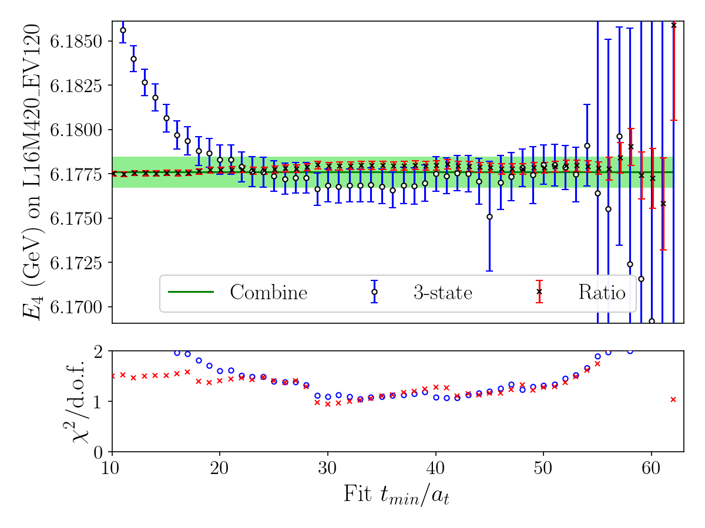
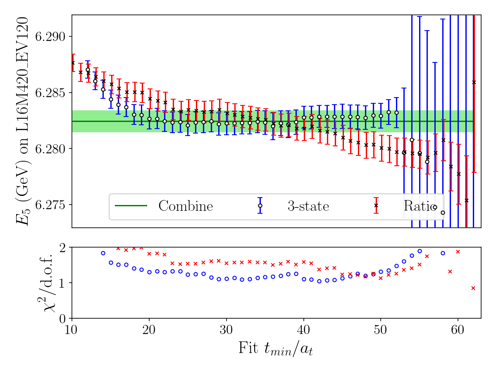

# Lattice QCD Tetraquark Scattering

[](https://github.com/Geng-Li-1995/lattice_scattering/actions/workflows/ci.yml)

Config-driven Python pipeline for lattice tetraquark spectroscopy and finite-volume scattering: **6D correlators** (\(\sim10^7\) `float64`/file, **401** samples on the `sample` axis), GEVP, Bayesian multi-state fits, jackknife resampling, and Lüscher \(K(s)\) / \(k\cot\delta_0\) extraction.

| | |
|--|--|
| **Systems** | `Tcccc6600`, `X3872`, `Zc3900` — switch via `BuildConfig("<System>")` in `main.py` |
| **Reference** | Tcccc6600: \(\eta_c\eta_c\) / \(J/\psi\,J/\psi\), \(L=12,16\), \(a_t^{-1}=7.219\) GeV |
| **Data** | Raw / resampled `.npy` are local (`data/<system>/`); not in git |
| **Stack** | Python 3.10+ · NumPy · SciPy · gvar · lsqfit · joblib · Matplotlib · pytest |

---

## Physics (Tcccc6600)

Fully-charm tetraquarks \(T_{cc\bar{c}\bar{c}}\) are exotic-hadron candidates at the LHC. Correlators → GEVP (remove \(\eta_c\eta_c\) / \(J/\psi\,J/\psi\) mixing) → Bayesian \(E_n\) fits → Lüscher scattering observables.

**Results:** evidence for a **\(2^{++}\)** structure in \(J/\psi\,J/\psi\) near **6.6 GeV**, compatible with **\(X(6600)\)** ([Nature **648**, 58 (2025)](https://www.nature.com/articles/s41586-025-09278-2); [arXiv:2506.07944](https://arxiv.org/abs/2506.07944)); separate **\(0^{++}\)** and **\(2^{++}\)** amplitudes from one GEVP spectrum.

| Stage | Method | Output |
|-------|--------|--------|
| Mixing | GEVP | Physical FVE levels |
| Spectroscopy | Multi-state cosh fit | \(E_n\), \(Z_n\) |
| Scale | Meson dispersion | \(\xi\) |
| Stability | \(t_{\min}\) scan + 4Q/2Q ratio | Window-robust \(E\) |
| Scattering | Lüscher zeta | \(K(s)\), \(k\cot\delta_0\) |
| Errors | Jackknife (401 samples) | Correlated uncertainties |

**Scattering:** \(K(s)\) encodes S-wave interaction strength vs \(s=m_{\rm CM}^2\); \(k\cot\delta_0\) gives the phase shift \(\delta_0\). **Zeros of \(K(s)\) are S-matrix poles** — lattice resonance/bound-state predictions comparable to experimental enhancements such as \(X(6600)\).

---

## Example results

\(L=12\) (`L12M420_EV170`) unless noted; \(t_{\min}\) scan: \(L=16\).

### GEVP

<p align="center">
  
  
</p>

### Effective mass \(E_n\) (meson ← · tetraquark →)

<p align="center">
  
  
</p>

### \(t_{\min}\) scan — \(J/\psi\,J/\psi\), \(n^2=0,1\)

3-state ○, ratio ×, Combine band (GeV, ±10× jackknife error).

<p align="center">
  
  
</p>

### Scattering — \(K(s)\), \(k\cot\delta_0\) (\(L=12+16\), 401 jackknife samples)

| Figure | Content |
|--------|---------|
| `K_s_scattering.png` | \(K(s)\) vs \(s\); **zero → S-matrix pole** (\(2^{++}\) / \(0^{++}\) from GEVP ordering) |
| `kcot_scattering.png` | \(k\cot\delta_0\) vs \(k^2\); same pole content |

Compared with the experimental \(X(6600)\) enhancement in double-\(J/\psi\) production.

<p align="center">
  
  
</p>

---

## Pipeline

```
data/<system>/raw/*.npy  […, sample=401]
        │
        ▼  main.py  (input/input_<System>.py switches)
   run_resample_statistics()     →  resampled/*.npy     (401× jackknife if enabled)
   process_GEVP()                →  4D tetraquark correlators
   effective_mass()              →  En, Zn, dispersion
   plot_tmin_workflow()          →  optional t_min + ratio plots
   run_scattering_analysis()     →  K(s), k cot δ₀
        │
        ▼
   result/<system>/*.{png,pdf}
```

**Execution order:** (1) build `Config` → (2) resample if `run_resample=True` → (3) meson branch if `is_meson_analysis` → (4) tetraquark branch (GEVP, fits, t_min) → (5) scattering if `run_scattering`. Meson and tetraquark switches are independent; scattering can run from existing `resampled/` alone.

**Technical notes:** `scipy.linalg.eig` + `numpy.einsum` GEVP; `lsqfit`/`gvar` Bayesian fits; `joblib` parallel zeta tables (\(10^5\) points, cached under `data/zeta/`); typed wrappers in `data/correlators.py`.

---

## Code layout

```
main.py
input/       config.py, input_<System>.py  (ENSEMBLE_DB: channels, priors, fit windows)
data/        correlators.py, io.py
analysis/    gevp.py, fit_mass.py, fit_tmin.py, scattering.py, models.py
statistics/  jackknife.py, bootstrap.py, resample.py
plotting/    plot_set.py, plot_gevp.py, plot_mass.py, plot_tmin.py, plot_scattering.py
tests/       docs/  (RUNNING.md, TESTING.md, DEPENDENCIES.md)
```

New system: copy `input/input_<System>.py`, add `data/<System>/raw/`, change `BuildConfig(...)` in `main.py`.

---

## Data

All arrays: **`float64`**. **`sample` = 401** jackknife replicas. **`mom`** = \(n^2\) array index. **`EV`** in filenames = distillation eigenvectors (not `sample` length).

### Shapes

| Object | Axes |
|--------|------|
| Meson raw | `[channel, mom, time, sample]` |
| Tetraquark raw (6D) | `[ch_src, mom_src, ch_snk, mom_snk, time, sample]` |
| After GEVP | `[channel, mom, time, sample]` |
| Resampled `En` | `[channel, mom, sample]` |

### Raw files (Tcccc6600)

| File | Shape | Size |
|------|-------|------|
| `correlation_meson_L12M420_EV170.npy` | `[2, 10, 96, 401]` | 5.9 MiB |
| `correlation_tetraquark_L12M420_EV170.npy` | `[2, 5, 2, 5, 96, 401]` | 29 MiB |
| `correlation_meson_L16M420_EV120.npy` | `[2, 10, 128, 401]` | 7.9 MiB |
| `correlation_tetraquark_L16M420_EV120.npy` | `[2, 5, 2, 5, 128, 401]` | 39 MiB |

~**82 MiB** raw per system (\(L=12+16\)). X3872/Zc3900 (\(L=16\)): meson `[6,5,128,401]`, tetraquark `[4,2,4,2,128,401]`.

### Resampled (`data/<system>/resampled/`)

| Pattern | Shape (example) |
|---------|-----------------|
| `resample_En_meson_*` | `[6, 5, 401]` |
| `resample_En_tetraquark_*` | `[1, 3, 401]` |
| `resample_ksi_meson_*` | `[6, 401]` |

Scattering uses **401-sample** correlated energies (no raw reload). `run_resample=True` costs **401×** GEVP+fit per volume; scattering/plotting afterward is cheap.

### Systems & ensembles

| System | \(L\) | EV | Channels |
|--------|-------|-----|----------|
| Tcccc6600 | 12, 16 | 170 / 120 | \(\eta_c\eta_c\), \(J/\psi J/\psi\) |
| X3872, Zc3900 | 16 | 70 | \(\pi J/\psi\), \(\rho\eta_c\), \(DD^*\), \(D^*D^*\) |

Tcccc6600: \(N_t=96/128\), \(m_\pi=420\) MeV, \(a_t^{-1}=7.219\) GeV; scattering uses `Ns_list = [12, 16]`.

---

## Usage

```bash
git clone https://github.com/Geng-Li-1995/lattice_scattering.git
cd lattice_scattering
python3 -m venv .venv && source .venv/bin/activate
pip install -r requirements.txt -r requirements-dev.txt
MPLBACKEND=Agg pytest && python main.py
```

Details: [docs/RUNNING.md](docs/RUNNING.md) · [docs/TESTING.md](docs/TESTING.md) · [docs/DEPENDENCIES.md](docs/DEPENDENCIES.md)

### Switches (`input/input_<System>.py`)

```python
lattice_Ns = 12
is_meson_analysis = True
is_tetraquark_analysis = True
is_gevp = True
run_tmin = True
is_ratio = True
run_resample = False   # True → 401× jackknife
run_scattering = True
plot_format = "png"    # or "pdf"
resample_type = "jackknife"
```

### Figure naming (`plot_format` extension; tag `L{Ns}M{M}_EV{EV}`)

| Plot | Pattern |
|------|---------|
| GEVP | `GEVP_{before,after,eigenvector}_{tag}` |
| \(E_n\) | `En_{meson,tetraquark}_{tag}` |
| \(t_{\min}\) | `E{n}_mom{n2}_tmin_{tag}` or `*_tmin_ratio_*` |
| Scattering | `K_s_scattering`, `kcot_scattering` (no volume tag) |

`E{n}` = tetraquark channel index; `mom{k}` = \(n^2=k\).

---

## Tests & CI

`pytest` on Python 3.10 & 3.12 without lattice data ([CI workflow](.github/workflows/ci.yml)): jackknife, I/O, scattering algebra, fit/t_min lookups.

---

## Publications

- G. Li, C. Shi, Y. Chen, and W. Sun, [*Scalar and Tensor Structures in $J/\psi J/\psi$ Scattering from Lattice QCD*](https://arxiv.org/abs/2505.24213), arXiv:2505.24213 [hep-lat]
- G. Li, C. Shi, Y. Chen, and W. Sun, [*$\eta_c\eta_c$ and $J/\psi J/\psi$ scattering from lattice QCD*](https://arxiv.org/abs/2505.23220), arXiv:2505.23220 [hep-lat]

---

## License

Not specified. Contact the maintainer before redistribution.
